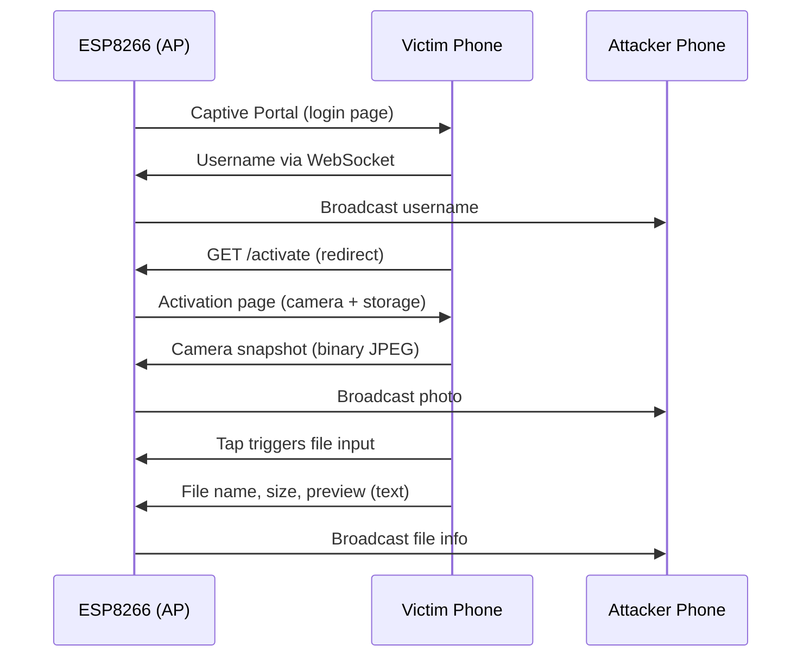

# CaptiveSnap
CaptiveSnap: ESP8266 evil‑portal that steals usernames, snaps a selfie, and grabs file previews – no internet needed. Hackathon/educational use only.

# 📡 CaptiveSnap – Advanced Rogue Wi‑Fi Demo (ESP8266)


**CaptiveSnap** is an **advanced, fully self‑contained rogue Wi‑Fi demo** built on the **ESP8266 NodeMCU**.  
It demonstrates – in a **controlled, ethical environment** – how an attacker can:

- **Capture usernames** through a realistic captive portal
- **Silently snap a front‑camera photo** using the victim’s own browser
- **Steal file previews** by disguising a file picker as “storage permission”
- **Relay all stolen data in real‑time** to an attacker’s phone – **without any internet connection**

Everything happens **offline**, inside the Wi‑Fi bubble created by the ESP8266.  
No laptop, no SIM card, no cloud – just a tiny microcontroller, two phones, and a powerful social‑engineering flow.

---

## 🧠 Table of Contents
- [✨ Features](#-features)
- [📦 Hardware](#-hardware)
- [⚙️ Software & Dependencies](#️-software--dependencies)
- [🚀 Quick Start](#-quick-start)
- [🕹️ How the Attack Works (Step‑by‑Step)](#️-how-the-attack-works-step‑by‑step)
- [🔍 Technical Deep Dive](#-technical-deep-dive)
- [🎨 Customisation](#-customisation)
- [🐍 Optional Python Logger](#-optional-python-logger)
- [🛠️ Troubleshooting](#️-troubleshooting)
- [⚠️ Ethical Use & Legal Notice](#️-ethical-use--legal-notice)
- [📄 License](#-license)
- [💖 Acknowledgements](#-acknowledgements)

---

## ✨ Features

| Feature | Description |
|--------|-------------|
| 🕸️ **Rogue Access Point** | Creates an open Wi‑Fi network (default `SIMATS`) with captive portal DNS redirection. |
| 🔐 **Fake Login Page** | Realistic username/password form – username is exfiltrated before login completes. |
| 📸 **Silent Camera Snapshot** | `getUserMedia()` activates the front camera, captures a 320×240 JPEG **without any shutter sound or preview** (photo is sent directly to attacker). |
| 📁 **File Preview Stealer** | Disguises a file input as “storage permission activation”. A single tap opens the file picker; selected file’s name, size, and first 100 characters are exfiltrated. |
| 🌐 **Real‑Time WebSocket Relay** | All stolen data (username, photo, file info) is broadcast live to an attacker’s mobile via WebSocket. |
| 🛡️ **Connectivity‑Check Spoofing** | Fake responses for Android, Windows, and Apple connectivity probes – prevents “No Internet” warnings. |
| 📱 **Mobile‑Only Attack** | No laptop needed – the entire attack chain happens between the ESP8266, the victim’s phone, and the attacker’s phone. |
| 🐍 **Optional Python Logger** | Connect a laptop to the rogue Wi‑Fi and run the included Python script to **save every photo and log entry with timestamps**. |

---

## 📦 Hardware

- **NodeMCU v3 (ESP8266)** – or any ESP8266 dev board (e.g., Wemos D1 Mini)
- Micro USB cable (for power & programming)
- Two smartphones (one attacker, one victim) for the demo

---

## ⚙️ Software & Dependencies

### Arduino IDE Setup
1. Install the ESP8266 board package:
   - `File` → `Preferences` → Additional Board Manager URLs:  
     `http://arduino.esp8266.com/stable/package_esp8266com_index.json`
   - `Tools` → `Board` → `Boards Manager` → search `esp8266` → install
2. Select **NodeMCU 1.0 (ESP-12E Module)** as the board.

### Libraries
Install via Arduino Library Manager (`Sketch` → `Include Library` → `Manage Libraries...`):
- **WebSockets** by Markus Sattler (version ≥ 2.3.6)

These libraries are **already built‑in** for ESP8266:
- `ESP8266WiFi`
- `ESP8266WebServer`
- `DNSServer`

---

## 🚀 Quick Start

1. **Download/clone** this repository.
2. Open `CaptiveSnap.ino` in the Arduino IDE.
3. **Optional**: Change `ap_ssid` (line 5) to any SSID you want (e.g., `FreeWiFi`, `Starbucks WiFi`).
4. **Upload** the sketch to your NodeMCU.
5. Open the **Serial Monitor** (115200 baud) – you should see `AP IP: 192.168.1.1` and `ESP8266 ready.`
6. The board now broadcasts an open Wi‑Fi network named `SIMATS` (or your custom SSID).

### 🎯 Demo Steps
1. **Attacker phone**:
   - Connect to `SIMATS`.
   - Open a browser and go to **`http://192.168.1.1/view`** → leave the page open.
2. **Victim phone**:
   - Connect to `SIMATS` → the captive portal should pop up automatically.
   - (If not, open any website – you’ll be redirected.)
   - Enter any username (password can be anything) and tap **Connect**.
3. The activation page will load and:
   - Request **camera permission** → a photo is taken silently.
   - Show *“Tap anywhere to grant storage permission”*.
4. Victim taps anywhere → the **file picker** opens. They choose a file.
5. **Watch the attacker’s phone** – the username, camera photo, and file details appear in real‑time!

---

## 🕹️ How the Attack Works (Step‑by‑Step)



ESP8266 starts in AP mode + DNS server that redirects all domains to 192.168.1.1.

Victim connects → OS performs captive portal detection → the login page is served.

Login form JavaScript opens a WebSocket to the ESP, sends USER:<name>, and redirects to /activate.

/activate page immediately calls getUserMedia() → snaps a 320×240 JPEG from the front camera, sends the binary over WebSocket.

After the photo, the page prompts “Tap anywhere to grant storage permission”. A hidden overlay catches the first tap, opens a hidden <input type="file">.

When the victim selects a file, FileReader reads it as text and sends FILE:<name>|<size>|<preview> over WebSocket.

The ESP8266 broadcasts all messages (text & binary) to every other WebSocket client – the attacker’s viewer page receives them instantly.

---

## 🔍 Technical Deep Dive

### 1. Network Orchestration & DNS Hijacking
The ESP8266 acts as an independent Access Point (AP) running a localized `DNSServer`. It is configured to respond to every inbound DNS query with its own gateway IP (`192.168.1.1`). 
* When a connected device attempts to resolve any internet URL, the DNS layer transparently hooks and points the request to the ESP.
* Combined with localized connectivity-check spoofing (handling responses for `generate_204`, `ncsi.txt`, and `hotspot-detect.html`), the client operating system assumes it is interfacing with a standard, valid public Wi-Fi registration infrastructure rather than a dead-end network.

### 2. Camera Capture (`getUserMedia`)
The activation landing page interfaces directly with standard device media constraints via `navigator.mediaDevices.getUserMedia({ video: { facingMode: "user" } })`. Once permission is explicitly granted by the user interaction flow, a frame is captured to a hidden canvas context for processing.

### 3. Client-Side Parsing (`FileReader` + WebSockets)
Following the media interface initialization, the interface requests storage confirmation. An invisible full-screen overlay (`#overlay`) intercepts the initial touch or click event. 
* Because this registration counts as an explicit, genuine user gesture under modern browser security models, it programmatically triggers `.click()` on a hidden `<input type="file">` element.
* When a target file context is parsed, `FileReader.readAsText()` processes the payload structure.
* To account for the highly restricted static RAM footprint of the ESP8266, only the first 100 characters (`FILE:name|size|preview`) are transmitted during the initial phase. Full file exfiltration can be achieved through sequential block chunking.

### 4. Real-Time WebSocket Relay
The ESP8266 runs a lightweight stateful `WebSocketsServer` listener on Port 81. Whenever a text frame or raw binary packet is received from the client page, the microcontroller uses `broadcastTXT()` or `broadcastBIN()` to mirror the incoming data directly to all other connected instances—allowing an administrative node or external logger to observe the transmission telemetry instantly.

---

## 🎨 Customisation Reference


| Parameter | Location | Default/Example | Purpose |
| :--- | :--- | :--- | :--- |
| **Wi-Fi SSID** | Line 5: `ap_ssid` | `"FreeWiFi"`, `"Starbucks WiFi"` | Access Point broadcast identifier |
| **Wi-Fi Password** | Line 6: `ap_password` | `"test1234"` *(Leave `""` for Open)* | Authentication mechanism string |
| **Camera Resolution** | `activatePage` | `{ video: { width: 320, height: 240 } }` | Balance frame clarity vs memory footprint |
| **JPEG Quality** | `canvas.toBlob()` | `0.6` *(Adjust from `0.1` to `1.0`)* | Compression ratio control |
| **File Preview Length**| `fileContent.substring`| `fileContent.substring(0, 100)` | Truncation safety threshold for static RAM |
| **Full Exfiltration** | Core JavaScript | *Advanced Feature* | Split data into sequential 500-char blocks |
| **Local Logging** | Core C++ Firmware | *SPIFFS / LittleFS Integration* | Commit received events to local non-volatile flash |

---

## 🐍 Optional Python Logger Configuration

You can run an automated background receiver on a local machine connected to the same infrastructure to log network interactions dynamically.

### Requirements
Ensure your Python environment has the required dependencies installed:
```bash
pip install websocket-client Pillow
```

### Execution
Run the logging agent from your terminal:
```bash
python esp_logger.py
```

No additional network configuration parameters are required; the script initializes an immediate stateful socket pipeline tracking `ws://192.168.1.1:81`. It automatically generates a structured `captured_data/` repository containing:
* `photo_YYYYMMDD_HHMMSS.jpg` – Saved raw binary JPEG camera snapshots.
* `log.txt` – Structured execution logs containing metadata, timestamps, and data previews.

---

## 🛠️ Troubleshooting Matrix


| Observed Issue | Probable Root Cause | Corrective Action |
| :--- | :--- | :--- |
| **Compilation Error:**<br>`ESP8266WiFi.h: No such file` | An incompatible microcontroller board layout (such as an ESP32 variant) is currently targeted in your IDE. | Navigate to `Tools` ➔ `Board` and select **NodeMCU 1.0 (ESP-12E Module)**. |
| **No Broadcast SSID Appears** | Inadequate power supply characteristics or a faulty interface interface cable. | Verify the USB cable line quality. The ESP8266 requires a stable **5V rail providing ≥500mA**. |
| **Captive Portal UI Fails to Display**| Cellular data interference or aggressive local OS caching mechanisms. | Open a browser manually and navigate directly to `http://neverssl.com`. Disable mobile data if testing. |
| **Camera Permission Ignored** | Secure context enforcement regulations (`HTTPS` / `localhost`). | While `192.168.x.x` ranges are usually white-listed locally, older legacy built-in captive browsers may block media access. Validate deployment utilizing a modern browser engine first. |
| **File Picker Does Not Open On Tap** | Event routing failure or explicit pop-up blocking rules. | Ensure the user interaction hits the overlay cleanly via an explicit tap/click gesture rather than a drag or swipe motion. |
| **Missing Visual Stream Frames** | Single-instance broadcast distribution behavior. | Ensure your administrative viewing window (`/view`) is completely initialized and connected *before* the target interacts with the interface. |
| **Microcontroller Panics/Reboots** | Out-of-memory (OOM) fault or transient power sag during transmission. | Reduce capture camera resolution limits, shorten file buffer array segments, or connect to a dedicated power supply. |

---

## ⚠️ Ethical Use & Legal Notice

This software suite is engineered and provided strictly for:
1. Authorized security architecture audits and formal penetration evaluation scenarios backed by explicit, written authorization.
2. Academic lectures, CTF exercises, and controlled hackathon scenarios where all participating entities maintain active consent.
3. Local analysis on physical hardware owned entirely by the developer.

Operating deployment mechanisms against endpoints without explicit, legally binding prior authorization is unlawful. The developers and contributors maintain no liability for target system disruption, unauthorized utilization, or external damage arising from misuse of this codebase. By compilation, execution, or handling of these components, you accept full accountability for maintaining lawful deployment boundaries.

---

## 📄 License

This repository is licensed under the terms of the **MIT License**. You are permitted to modify, share, and reuse the source implementation freely, provided the original copyright header is preserved intact across all derivative editions. Distributed "as-is" without explicit warranty of any kind.

---

## 💖 Acknowledgements

* Built with care for educational hackathon challenges.
* Special thanks to the open-source **ESP8266/Arduino** development ecosystem.
* WebSocket engine implementation courtesy of the `links2004/arduinoWebSockets` project.

Camera and file‑stealing ideas inspired by modern social‑engineering research.
